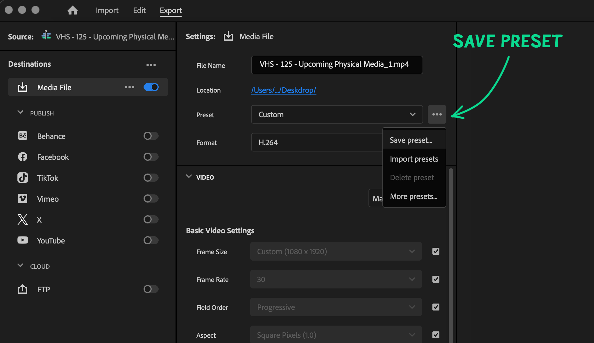

# Premiere Marker Export

A small Adobe Premiere Pro panel that exports a clip for every sequence marker.
Drop markers on your timeline, click one button, and each segment is queued to
Adobe Media Encoder as its own file.


## What it does

For each sequence marker, it exports the timeline from that marker to the
**next** marker (or uses the marker's own duration, if it has one). The last
marker just closes off the final segment — so **4 markers → 3 clips:**


Files are named `NNN_<marker name>.<ext>`, where the extension comes from the
Adobe Media Encoder preset you choose.

---

## Install (the easy way)

This panel is **unsigned**, so installing it normally means fiddling with
debug-mode flags and hidden extension folders that differ per OS. Instead, let
[Claude Code](https://claude.com/claude-code) or
[Codex](https://openai.com/codex) do it.

Open Codex / Claude Code and paste this in as your message:

```
Can we install this Premiere panel for my OS: https://github.com/texjer/premiere-marker-export
```

The agent will clone the repo, detect macOS vs Windows, enable unsigned CEP
extensions, and install the panel into the right folder. Then fully quit and
reopen Premiere Pro and find it under **Window → Extensions → Marker Export**.

## Install (manual)

If you'd rather do it yourself:

1. Clone this repo:
   ```bash
   git clone https://github.com/texjer/premiere-marker-export.git
   cd premiere-marker-export
   ```
2. Run the installer for your platform from the repo root:

   **macOS / Linux**
   ```bash
   ./install.sh
   ```

   **Windows (PowerShell)**
   ```powershell
   ./install.ps1
   ```

Then **fully quit and reopen Premiere Pro** → **Window → Extensions → Marker Export**.

> The installers enable `PlayerDebugMode` (so Premiere will load this unsigned
> panel) and place the panel in your CEP extensions folder:
> - macOS: `~/Library/Application Support/Adobe/CEP/extensions/`
> - Windows: `%APPDATA%\Adobe\CEP\extensions\`

---

## Usage

1. Open a sequence and add markers where you want clips to start/end.
2. **Make a preset.**

   

   Since this plugin skips the normal "Export" process, you'll need to first
   start to export your video normally and then **Save Preset** (the **···**
   menu next to *Preset*). Then go back to our panel and select it by clicking
   **Set Preset…** and picking the file you just saved (see picture above).
3. Open the panel: **Window → Extensions → Marker Export**.
4. **Set Folder…** — choose where exports go.
5. **Set Preset…** — pick the `.epr` preset you saved. The dialog opens in your
   AME *Presets* folder, where saved presets live.
6. **Export Video Clips** — clips are queued and run in Adobe Media Encoder.

Your folder and preset are remembered between sessions.

---

## Uninstall

Delete the panel from your CEP extensions folder:

- macOS: `rm ~/Library/Application\ Support/Adobe/CEP/extensions/com.texs.markerexport`
- Windows: delete `%APPDATA%\Adobe\CEP\extensions\com.texs.markerexport`

(Or just tell Claude Code: *"Uninstall the Marker Export panel."*)

---

## Compatibility

- **Premiere Pro 2019–2026+** (CEP 9–13), on **macOS and Windows**.
- Requires **Adobe Media Encoder** installed (the panel queues exports to it).

## Notes

- This is a **CEP** panel. CEP is deprecated in favor of UXP but still works in
  current Premiere; a UXP port may come later.
- The standalone `export-markers-as-clips.jsx` is the same logic without the
  panel — run it via Adobe's VS Code ExtendScript Debugger if you prefer.

## License

[MIT](LICENSE)
